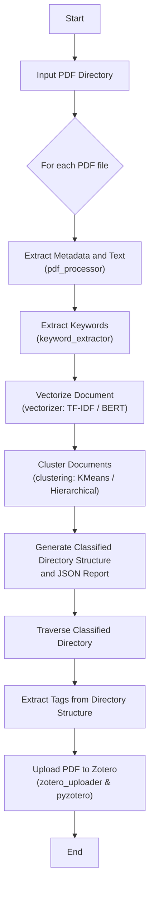

# PDF Auto Classifier & Zotero Uploader

本项目实现了从 PDF 自动分类到自动上传至 Zotero 的完整流程。系统主要功能包括：

- **PDF 解析**：利用 [pdfplumber](https://github.com/jsvine/pdfplumber) 提取 PDF 文件的文本和元数据。
- **关键词抽取**：通过简单的词频统计（可扩展 TF-IDF、TextRank、RAKE 等方法）自动抽取文档关键词。
- **文档向量化**：支持基于 TF-IDF 和预训练 BERT 模型（[SentenceTransformers](https://www.sbert.net/)）两种向量化方法。
- **文档聚类与目录名称生成**：支持 KMeans 和层次聚类（AgglomerativeClustering）两种方法，对文档进行自动分组。
  - 利用 `cluster_documents` 对所有文档向量进行聚类。
  - 根据每个聚类中的所有文档文本，调用 `extract_topic_keywords`（在 `lda_topic_extractor.py` 中实现）生成聚类的主题关键词，并拼接聚类编号生成目录名称。
- **文件移动与报告生成**
  - 根据生成的目录名称，将每个 PDF 文件复制到对应目录下，并生成 JSON 格式的处理报告；
  - 同时保存预处理数据（文本、元数据、向量），便于后续单独使用。
- **Zotero 上传**：利用 [pyzotero](https://pyzotero.readthedocs.io/) 将自动分类后的 PDF 上传至 Zotero，并根据分类目录生成标签。

## 目录结构

```bash
pdf_auto_classifier/
├── config/                    
│   ├── config.yml                # 系统配置（阈值、向量化方法、聚类方法、预处理设置、NLTK 资源路径等）
│   ├── taxonomy.yml              # 可选：静态分类树配置（若需要人工干预时使用）
│   └── zotero_config.yml         # Zotero 配置（包含 library_id、api_key、library_type 等）
├── data/
│   ├── classified/               # 自动分类后输出的 PDF 文件目录
│   └── logs/                     # 日志和报告文件目录 
├── requirements.txt              # Python 依赖包列表
└── src/
    ├── __init__.py
    ├── main.py                   # 主程序入口（PDF解析、关键词抽取、向量化、聚类、分类输出、生成报告）
    ├── lda_topic_extractor.py    # 封装 LDA 主题提取功能
    ├── pdf_processor.py          # PDF解析模块，提取文本与元数据
    ├── keyword_extractor.py      # 关键词抽取模块（示例采用简单词频统计）
    ├── vectorizer.py             # 文档向量表示模块（支持 TF-IDF 和 BERT 两种方法）
    ├── clustering.py             # 文档聚类模块（支持 KMeans 与层次聚类两种方法）
    ├── keyword_validator.py      # 关键词有效性检测模块（利用 NLTK 词库判断关键词是否有意义）
    ├── semantic.py               # 语义分析模块（示例中提供余弦相似度计算）
    └── zotero_uploader.py        # 上传模块（将分类后的 PDF 自动上传至 Zotero 并打上标签）
```


## 项目流程图



## 安装步骤

1. **克隆仓库**

   ```bash
   git clone <repository-url>
   cd pdf_auto_classifier
   ```

2. **创建虚拟环境并安装依赖**

   ```bash
   python -m venv .venv
   # Linux/MacOS:
   source .venv/bin/activate
   # Windows:
   .venv\Scripts\activate
   pip install -r requirements.txt
   ```

## 配置

项目主要通过配置文件 `config/config.yml` 来管理各项参数，包括文本匹配、预处理、NLTK资源路径以及输入输出目录。例如：

```yaml
matching:
  threshold: 1                 # 文档匹配阈值
  vector_method: "tfidf"        # 文本向量化方法: "tfidf" 或 "bert"
  clustering_method: "hierarchical"  # 聚类方法: "kmeans" 或 "hierarchical"
  num_clusters: 10              # 目标聚类数
  max_clusters: 10              # KMeans 最大聚类数
  top_n_keywords: 10
  visualize: false              # 是否显示聚类可视化

preprocessing:
  remove_stopwords: true        # 是否去除停用词
  lowercase: true               # 是否转换为小写
  stemming: false               # 是否进行词干提取

nltk:
  nltk_path: "F:/zotero_root/nltk_data"  # NLTK 数据路径
  nltk_download: true                  # 是否自动下载 NLTK 需要的资源

input_output:
  input_dir: "F:/zotero_root/raw_pdfs"  # 输入 PDF 文件夹
  output_dir: "data/classified"         # 输出分类结果文件夹
```

除了系统配置，还可以配置：
- **静态分类树**（可选）：编辑 `config/taxonomy.yml` 以提供预定义的分类结构。
- **Zotero 配置**：编辑 `config/zotero_config.yml` 填写您的 Zotero 相关信息，例如 `library_id`、`api_key` 和 `library_type`。

## 使用方法

### 1. PDF 自动分类

将待分类的 PDF 文件放入指定目录（例如 `F:\zotero_root\raw_pdfs`），然后运行主程序进行自动分类：

```bash
python src/main.py --input "F:\zotero_root\raw_pdfs" --output "data/classified" --config config/config.yml
```

该命令将完成以下操作：

- 根据配置文件中设定的预处理规则（如去除停用词、转换为小写等）解析 PDF 文件，提取文本与元数据；
- 自动抽取关键词并生成文档向量（支持 TF-IDF 或 BERT）；
- 利用配置中的聚类方法对文档进行分组，并调用 LDA 模块生成聚类主题关键词，从而构建目录名称；
- 将 PDF 文件复制到 `data/classified` 目录中，并按照聚类结果生成目录结构；
- 生成 JSON 格式的报告文件，保存于 `data/logs/report.json`；
- 保存预处理数据（文本、元数据、向量）到 `data/logs/preprocessed` 目录；
- 统一在 main 函数中根据 config.yml 设置 NLTK 资源路径及是否下载所需的 NLTK 数据（例如 `words` 与 `stopwords`），避免各模块重复下载。

### 2. 上传分类后的 PDF 到 Zotero

自动分类完成后，运行以下命令将 PDF 文件上传到 Zotero，并自动打上标签（标签根据目录结构生成，例如 `cluster_2` 等）：

```bash
python src/zotero_uploader.py --config config/zotero_config.yml --input data/classified
```

该命令将：

- 遍历 `data/classified` 下的所有 PDF 文件；
- 根据文件所在目录生成标签；
- 利用 Zotero API 上传 PDF 文件，并为每个文件打上相应标签。

## 依赖

- Python 3.x
- [pdfplumber](https://github.com/jsvine/pdfplumber)
- [PyYAML](https://pyyaml.org/)
- [tqdm](https://github.com/tqdm/tqdm)
- [scikit-learn](https://scikit-learn.org/)
- [numpy](https://numpy.org/)
- [nltk](https://www.nltk.org/)
- [sentence-transformers](https://www.sbert.net/)
- [pyzotero](https://pyzotero.readthedocs.io/)

请确保按照 `requirements.txt` 安装所有依赖。

## 许可证

本项目采用 MIT 许可证，详情请参阅 [LICENSE](LICENSE) 文件。

## 致谢

感谢所有开源项目的开发者们，特别是 pdfplumber、SentenceTransformers、pyzotero 和 scikit-learn 的开发团队，为本项目提供了关键技术支持。